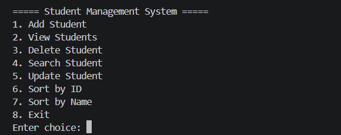
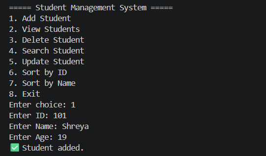
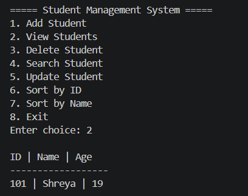

# 🎓 Student Management System (Java)

A console-based Java application to manage student records using Object-Oriented Programming and file handling.

---

## 🚀 Features

* ➕ Add new students
* 📋 View all student records
* 🔍 Search student by ID
* ✏️ Update student details
* ❌ Delete student
* 🔄 Sort by ID and Name
* 💾 Persistent storage using file handling
* 🛡️ Input validation (prevents crashes)

---

## 🛠️ Tech Stack

* Java
* OOP (Encapsulation, Modular Design)
* File Handling
* CLI (Console-based UI)

---

## 📁 Project Structure

```plaintext id="q4v3dx"
student-management-system-java/
│
├── src/
│   ├── Main.java
│   ├── Student.java
│   ├── StudentService.java
│   └── FileHandler.java
│
├── students.txt
├── menu.png
├── add-student.png
├── view-students.png
│
├── README.md
├── .gitignore
└── LICENSE
```

---

## ▶️ How to Run

```bash id="y0q0mg"
javac src/*.java
java -cp src Main
```

---

## 📸 Demo

### 🧾 Main Menu



### ➕ Add Student



### 📋 View Students



---

## 💡 Future Improvements

* GUI using JavaFX / Swing
* Database integration (MySQL)
* Login system (Admin/User roles)
* REST API version

---

## 👨‍💻 Author

Shreya Rai

---

## ⭐ If you like this project

Give it a star ⭐ and feel free to fork it!
